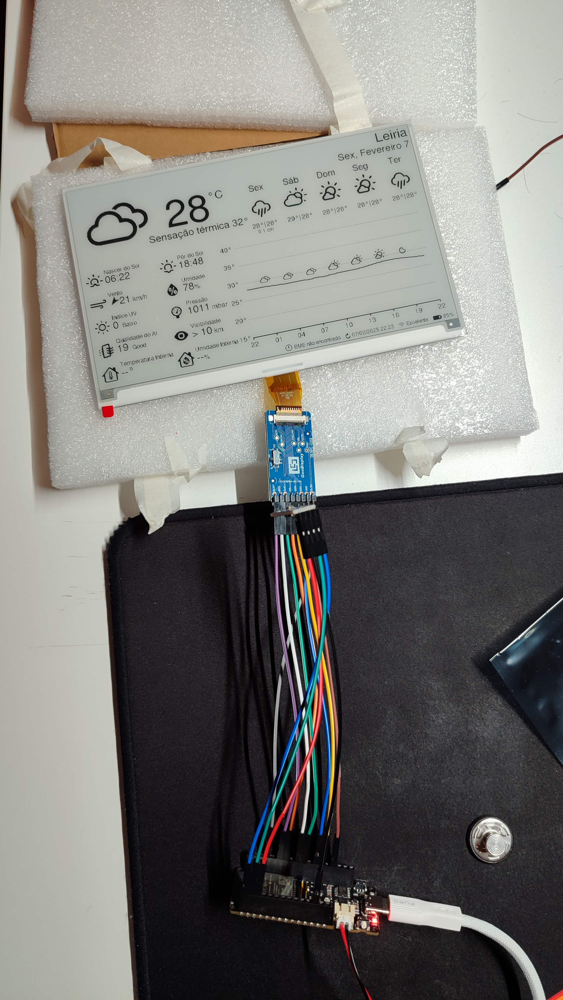
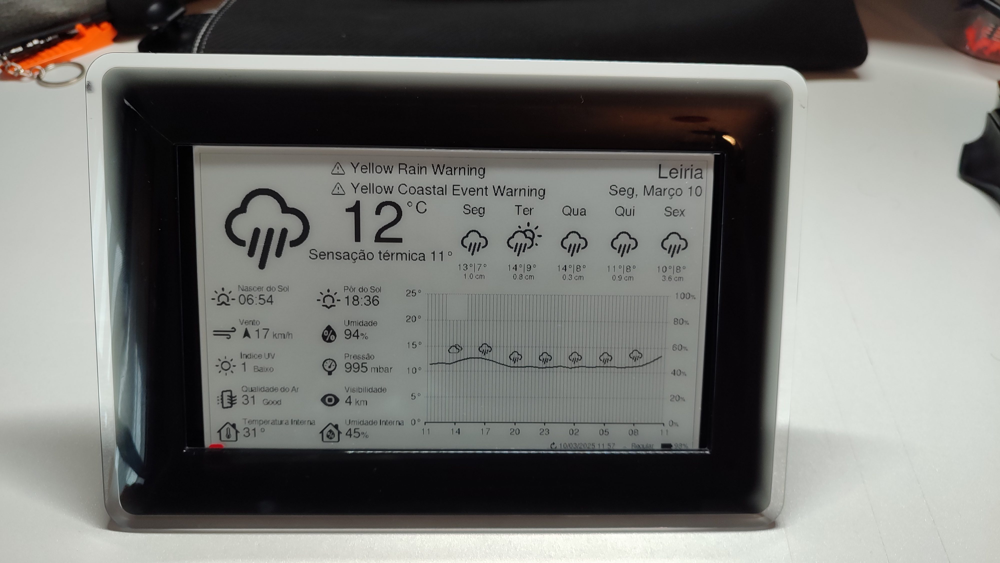
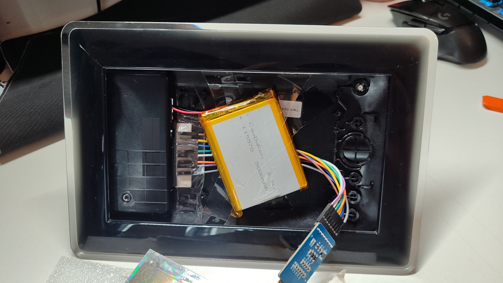
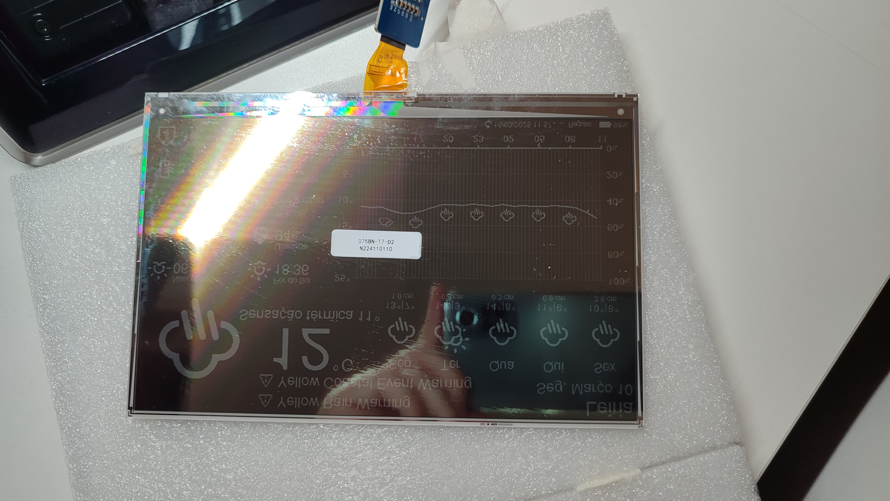
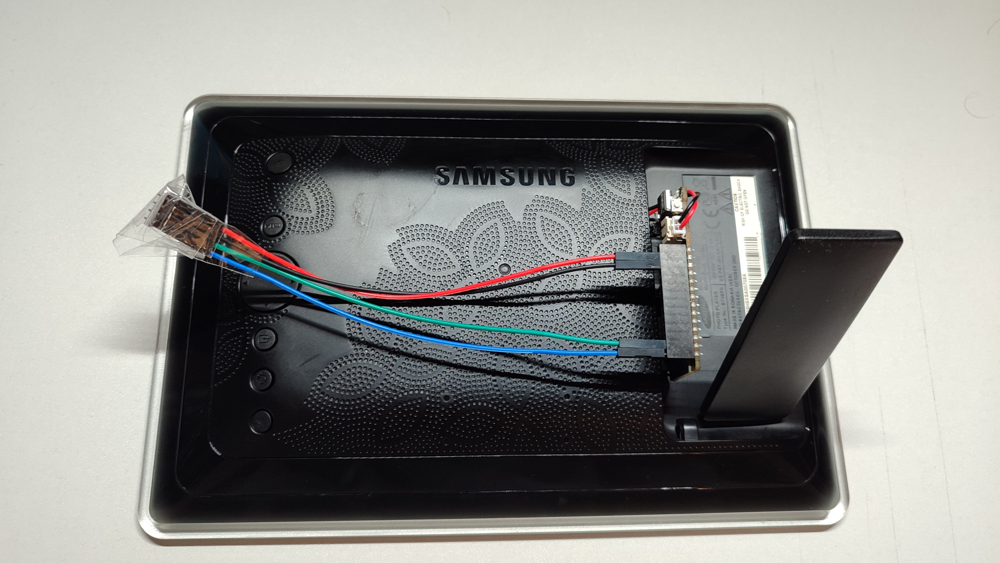

# ESP32 E-Paper Weather Display

This is a weather display powered by a wifi-enabled ESP32 microcontroller and a 7.5in E-Paper (aka E-ink) display. Current and forecasted weather data is obtained from the OpenWeatherMap API. A sensor provides the display with accurate indoor temperature and humidity.

This project is an adpatation of [esp32-weather-epd](https://github.com/lmarzen/esp32-weather-epd) all coding,wiring configuration and hardware especification credits belong to the owner and contributors of the original project.

## Development
### Prototype
The first prototype was just to ensure all the components worked together and the API keys also allowed for requesting.

  

As you can see the first prototype had some configuration errors, for example the temperature was showing 28ºC which is really high for the month of february in Portugal 😅 (Actual temperature was around 6ºC)

The prototype also had problems regarding the hardware, the BME280 Pressure, Temperature, and Humidity Sensor was not being registered by the software.

### Semi-final Product
For this phase i got the frame of the Samsung SPF-85H Photo Frame (depicted below). The LCD display was only showing white light so i reutilized the frame for this project and the LCD screen will be used in a future one.

  

This frame was perfect for this project, i made a small cut near the SD card reader slot so that the esp-32 female pin headers could be inserted. This was almost a perfect fit so i added little rubber padding in the interior so that i could secure them with tape. (I didnt want to use any kind of permanent glue because it would be cool to re-use the esp32 in other projects)

  

Unfortunately i still hadnt had the tools to solder the bme280 sensor to its female adpaters so i taped the sensor together with the wires

  
  
  
  

### Final Product - (WIP)
#### TODO List

| ✅ | Title | Description |
|---|--------|-----------|
| [ ] Create a locale_pt_PT | Create the file to update the text to pt_PT |
| [ ] Solder sensor headers | - |
| [ ] Hide the sensor behind the display | - |